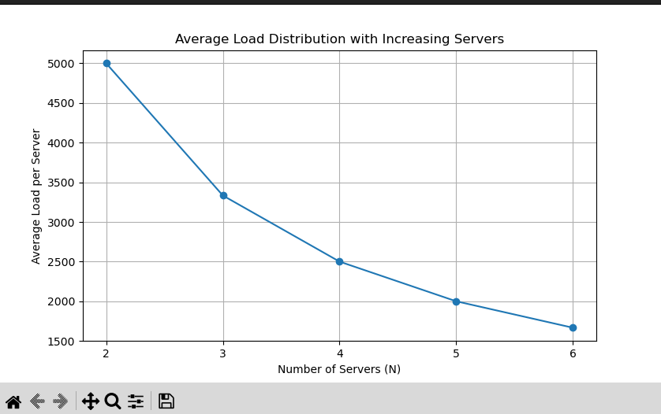

# Distributed_Systems

## Implementing a customizable Load Balancer

## Coding Environment

- Programming Language: python
- Operationg System: Ubuntu 24.04 LTS or above
- Docker: Version 20.10.23 or above

## Task Description

### 1. SERVER

In this task, three files were created:

#### Files Included:

1. **server.py**: This file contains the Python script for the Flask server application. It defines two routes `/home` and `/heartbeat` and utilizes environment variables to determine the server ID.

2. **requirements.txt**: This file lists the Python dependencies required for the Flask server application. It is used during the Docker image build process to install the necessary packages.

3. **Dockerfile**: This file specifies the instructions to build a Docker image for the Flask server application. It uses the Python 3.12 base image, sets the working directory, copies the requirements file, and installs dependencies.

---

#### Running the Application:

1. **Build Docker Image**:

   ```
   docker-compose build 
   ```

   This command builds a Docker image named `docker_image` based on the instructions in the Dockerfile.

2. **Start the services**:

   ```
   docker-compose up -d
   ```

3. **Stop the services**:
   ```
   docker-compose down
   ```

---

#### Accessing the Application:

- When accessing the `/home` and `/heartbeat` routes make sure that the docker has been built and started

- To access the `/home` route of any server, use the following curl command:

  ```
  curl http://localhost:5000/home
  ```

- To check the heartbeat of any server, use the following curl command:
  ```
  curl http://localhost:5000/heartbeat
  ```

---

#### Note:

- Ensure Docker is installed and running on your system before running these commands.
- If the docker-compose up command has not been used, accessing the `/home` and `/heartbeat` routes will only bring about errors


### 2. CONSISTENT HASHING
In this task, one file was created:

#### File included:
1. consistenthashing.py

### Features

- **Consistent Hashing**: Uses a circular hash structure to distribute requests.
- **Virtual Servers**: Replicates each physical server to better distribute load.
- **Load Balancing**: Efficiently maps client requests to server containers.
- **Fault Tolerance**: Handles server addition and removal gracefully.

### Implementation Details

#### Parameters

- **Number of Server Containers (`N`)**: 3
- **Total Number of Slots in Hash Map (`#slots`)**: 512
- **Number of Virtual Servers per Server Container (`K`)**: 9 (calculated as `log2(512)`)

#### Hash Functions

- **Request Mapping (`H(i)`)**: \( H(i) = i + 2i^2 + 17 \)
- **Virtual Server Mapping (`Φ(i, j)`)**: \( Φ(i, j) = i + j + 2j^2 + 25 \)

#### Collision Handling

In case of a collision, quadratic probing is used to find the next suitable slot.

#### Usage

The script initializes a consistent hash map with 3 server containers, maps requests to these servers, and demonstrates adding and removing servers.

#### Running the script

```
python3 consistenthashing.py
```

### 3. LOAD BALANCER

In this task three files were created:

1. loadbalancer.py
2. Dockerfile - it was updated so as to containerize the load balancer
3. Makefile - to deploy the whole stack in the Ubuntu environment

The values created in the consistent_hash_map.py, were used in the loadbalancer.py.
**Primary task of the loadbalancer**

1. to route the client requests to one of the server replicas so that the overall load is equally distributed across the available replicas

### 4. ANALYSIS
Run the analysis.py file
1. After launching the async requests for N=3 srevers, it is observed that It can be observed that Server 1 and Server 2 handled a relatively similar number of requests, while Server 3 handled slightly fewer requests compared to the other two servers.This indicates that the load balancer effectively distributed the incoming requests among the available server containers, achieving a nearly balanced workload distribution.
2. When the number of servers is increased from 2 to 6 and 1000 requests launched, the average load per server reduces significantly , indicating that the load balancer distributes requests evenly among the additional server containers, resulting in a more balanced and effecient resource utilization.
3. Use the curl command to send requests.
   ``` curl http://0.0.0.0:5000/rep```
   ```curl -X POST -d '{"n": 1, "hostnames": ["new_server"]}' -H "Content-Type: application/json" http://localhost:5000/add```
   ```curl http://0.0.0.0:5000/home```
   Stop one of the server container:
   ```docker stop <server_id>```
When requests are sent to the load balancer,it automatically detects failure and redistributes the requests to healthy servers.
5. A more balanced distribution of requests among all the server containers is observed.Fault tolerance and effecient detection of failures.
 
### Images

